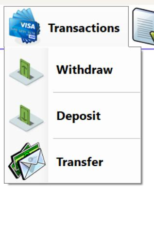

# 🏦 Bank Management System

A comprehensive banking management system - Built with C# WinForms and SQL Server using 3-tier architecture.

## 📋 Table of Contents

- [About the Project](#about-the-project)
- [Features](#features)
- [Technologies](#technologies)
- [Architecture](#architecture)
- [Screenshots](#screenshots)

## 🎯 About the Project

This project is a comprehensive management system designed to handle modern banking operations in a digital environment. Developed using a 3-tier architecture, the system provides a secure and scalable structure.

### Main Objectives
- Streamline person and customer management
- Provide money transfer operations
- Automate account management processes
- Enhance banking experience with user-friendly interface

## ✨ Features

### 👥 Person Management
- **Person Operations**: Add, delete, update, retrieve, and search
- **User Management**: System user administration
- **Customer Management**: Bank customer registration and tracking

### 💳 Account Management
- Open accounts for customers
- Update account information
- Delete accounts
- View account details

### 💰 Financial Operations
- **Money Transfer**: Secure inter-account money transfers
- **Cash Withdrawal**: ATM-like withdrawal operations
- **Money Deposit**: Deposit money to accounts
- **Balance Inquiry**: Real-time account balance viewing

## 🛠️ Technologies

### Frontend
- **C# WinForms**: Desktop user interface
- **ADO.NET**: Data access technology
- **Delegation & Events**: Event-driven programming

### Backend
- **SQL Server**: Primary database system
- **T-SQL**: Advanced query language
- **Stored Procedures**: Optimized database operations
- **Views**: Data presentation layer

### Programming Patterns
- **3-Tier Architecture**: Layered architecture approach
- **Event-Driven Programming**: Event-based programming
- **Delegation Pattern**: Delegate design pattern

## 🏗️ Architecture

The project is developed using 3-Tier Architecture:

```
┌─────────────────────────────┐
│     Presentation Layer      │  ← WinForms UI
│         (UI Layer)          │
├─────────────────────────────┤
│      Business Layer         │  ← Business Logic
│    (Business Logic Layer)   │
├─────────────────────────────┤
│    Data Access Layer        │  ← Data Access
│   (Data Access Layer)       │
└─────────────────────────────┘
              │
    ┌─────────────────┐
    │   SQL Server    │
    │   Database      │
    └─────────────────┘
```

### Layer Responsibilities

#### 🖥️ Presentation Layer
- User interface management
- User interactions
- Data visualization
- Form validations

#### ⚙️ Business Layer
- Business rule implementation
- Data validation
- Business process coordination

#### 🗃️ Data Access Layer
- Database connectivity
- CRUD operations
- Stored procedure calls
- Data transformation

## 🖼️ Screenshots

### Main Screen


### People List


### Clients List


### Users List


### Transactions


### Transfer


### Deposite


### Withdraw


### Transfer log


### Login log


### Update Person Info


### User Details


### Account Settings


### Change Password


