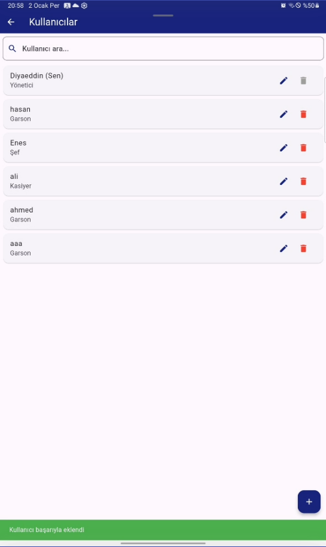

# ☕ Cafe Order Management System

A comprehensive cafe management solution with real-time order processing - Built with Flutter mobile app and ASP.NET Core Web API backend.

## 📋 Table of Contents

- [About the Project](#about-the-project)
- [Features](#features)
- [Technologies](#technologies)
- [Architecture](#architecture)
- [User Roles](#user-roles)
- [Screenshots](#screenshots)
- [Contact](#Contact)

## 🎯 About the Project

This is a full-stack cafe management system designed to streamline restaurant operations from order taking to payment processing. The system provides role-based access for different staff members and real-time order management capabilities.

### Key Benefits
- **Order Processing**: Communication between waiters, chefs, and cashiers
- **Multi-role Management**: Different interfaces for different staff roles
- **Mobile-first Design**: Flutter-powered mobile application for enhanced mobility
- **Comprehensive Reporting**: Daily, monthly, and yearly sales analytics
- **Table Management**: Table status tracking

## ✨ Features

### 👨‍🍳 For Waiters
- **Table Overview**: View all tables and their current status
- **Order Taking**: Select tables and add menu items to orders
- **Table Status Management**: Track occupied and available tables

### 👨‍🍳 For Chefs
- **Order Queue**: View all incoming orders from all waiters and tables
- **Order Management**: Mark orders as prepared and ready for serving
- **Order Completion**: Transfer completed orders back to waiters

### 💰 For Cashiers
- **Table-based Billing**: Access orders by table number
- **Order Summary**: View all items ordered by customers at specific tables
- **Payment Processing**: Calculate total amounts and process payments
- **Table Reset**: Clear table status after payment completion

### 👨‍💼 For Managers
- **User Management**: Create, update, and manage staff accounts
- **Menu Management**: Add, edit, and remove menu items
- **Table Configuration**: Manage table setup and configuration
- **Analytics Dashboard**: Comprehensive reporting system
  - Daily sales reports
  - Monthly performance analytics
  - Yearly revenue tracking
  - Product popularity analysis

## 🛠️ Technologies

### Frontend (Mobile App)
- **Flutter**: Cross-platform mobile development framework
- **Dart**: Programming language for Flutter
- **HTTP Package**: REST API communication
- **Provider/Bloc**: State management

### Backend (Web API)
- **ASP.NET Core Web API**: RESTful API framework
- **C#**: Primary programming language
- **ADO.NET**: Data access technology

### Database
- **SQL Server**: Primary database system
- **T-SQL**: Advanced query language
- **Stored Procedures**: Optimized database operations
- **Database Views**: Complex data retrieval
- **Indexes**: Performance optimization

### Development Tools
- **Visual Studio**: IDE for backend development
- **Visual Studio Code**: Flutter development
- **SQL Server Management Studio**: Database management
- **Postman**: API testing

## 🏗️ Architecture

The system follows a modern microservices-inspired architecture:

```
┌─────────────────────────────┐
│      Flutter Mobile App     │  ← Cross-platform UI
│        (Frontend)           │
└─────────────┬───────────────┘
              │ HTTP/REST
              │
┌─────────────▼───────────────┐
│    ASP.NET Core Web API     │  ← Business Logic
│       (Backend API)         │
└─────────────┬───────────────┘
              │ Entity Framework
              │
┌─────────────▼───────────────┐
│       SQL Server            │  ← Data Storage
│       Database              │
└─────────────────────────────┘
```

### Architecture Components

#### 📱 Mobile Application Layer
- User interface and experience
- State management


#### 🔌 API Layer
- RESTful endpoints
- Business logic implementation
- Data validation
- Error handling

#### 🗃️ Data Layer
- ADO.NET
- Data access logic


## 👥 User Roles

### 🍽️ Waiter Role
**Permissions**: Table management, order creation
```
- View all tables
- Select available tables
- Add items to orders
- Submit orders to kitchen
```

### 👨‍🍳 Chef Role
**Permissions**: Order processing, kitchen management
```
- View incoming orders
- Mark orders as prepared
- Complete order processing
- Kitchen queue management
```

### 💳 Cashier Role
**Permissions**: Payment processing, billing
```
- Access table orders
- View order totals
- Process payments
```

### 🏢 Manager Role
**Permissions**: Full system administration
```
- User management (CRUD)
- Menu item management
- Table configuration
- Sales reporting
- System analytics
```

## 🖼️ Screenshots

### 📱 Login Screen
<div style="display: flex; flex-wrap: wrap; gap: 10px;">
  
  
  
  
  
</div>

### 🧑‍💼 Waiter Interface
<div style="display: flex; flex-wrap: wrap; gap: 10px;">
  
  
  
  
  
  
</div>

### 👨‍🍳 Chef Interface
<div style="display: flex; flex-wrap: wrap; gap: 10px;">
  
  
</div>

### 💰 Cashier Interface
<div style="display: flex; flex-wrap: wrap; gap: 10px;">
  
  
  
  
</div>

### 👔 Manager Interface
#### Tables Management
<div style="display: flex; flex-wrap: wrap; gap: 10px;">
  
  
  
  
</div>

#### Products Management
<div style="display: flex; flex-wrap: wrap; gap: 10px;">
  
  
  
</div>

#### Users Management
<div style="display: flex; flex-wrap: wrap; gap: 10px;">
  
  
  
  
  
  
  
  
</div>

#### Reports & Analytics
<div style="display: flex; flex-wrap: wrap; gap: 10px;">
  
  
  
  
  
</div>

#### Multi-language Support
<div style="display: flex; flex-wrap: wrap; gap: 10px;">
  
  
  
</div>


## 📬 Contact  
- 💻 **Portfolio**:[Diyaeddin Habdo](https://diyaeddin-habdo.github.io/portfolio/)
- 📧 **Email**: [diyahabdo@gmail.com](mailto:diyahabdo@gmail.com)  
- 💼 **LinkedIn**: [Diyaeddin Habdo](https://www.linkedin.com/in/diyaeddin-habdo-0b26a3236/)  
- 🐱 **GitHub**: [@Diyaeddin-Habdo](https://github.com/Diyaeddin-Habdo)  
- 📸 **Instagram**: [@Diyaeddin_376](https://www.instagram.com/eng.diyaeddin?igsh=ZHpqOGtsNWQ0aGox)  