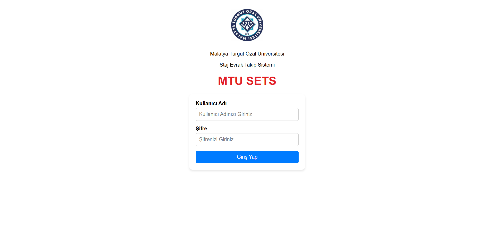

# 📋 Internship Document Tracing System

*A modern web application for streamlined internship document management and approval workflows*

---

## 🎯 **Project Overview**

The Internship Document Tracing System revolutionizes the traditional paper-based internship document management process by providing a comprehensive digital platform. This system enables seamless collaboration between students, instructors, and advisors through an intuitive approval workflow.

### ✨ **Key Highlights**
- 🔐 **Secure Authentication** with JWT tokens
- 📄 **Multi-format Document Support** 
- 🔄 **Real-time Status Tracking**
- 👥 **Role-based Access Control**

---

## 🖼️ **Application Screenshots**

  

    
  

  

    
  

  

    
  

  

    
  

  

    
  

  

    
  

  

    
  

  

    
  

  

    
  

  

    
  

  

    
  

  

    
  

  

    
  

  

    
  

  

    
  

  

    
  

  

    
  

  

    
  

  

    
  

  

    
  

  

    
  

---

## 🛠️ **Technology Stack**

### **Backend Technologies**

### **Frontend Technologies**

### 🏗️ **Architecture & Features**

| Component | Technology | Description |
|-----------|------------|-------------|
| **API** | ASP.NET Core Web API | RESTful API with JWT authentication |
| **Database** | SQL Server + ADO.NET | Robust data management with stored procedures |
| **Frontend** | React SPA | Modern, responsive user interface |
| **Architecture** | 3-Tier Pattern | Separation of concerns and maintainability |
| **Security** | JWT + Role-based Access | Secure authentication and authorization |

### 🎭 **User Roles & Permissions**

| Role | Permissions | Dashboard Features |
|------|-------------|-------------------|
| 🎓 **Student** | Upload documents, Track status | Document submission, Status tracking |
| 👨‍🏫 **Instructor** | Review & approve documents | Review queue, Approval workflow |
| 👨‍💼 **Advisor** | Final approval authority | Final review, Batch processing |

---

## 🔄 **Workflow Process**

---

## 🔒 **Security Features**

- 🛡️ **JWT Authentication** - Secure token-based authentication
- 🔐 **Role-based Access Control** - Granular permissions
- 🔒 **Input Validation** - Prevention of malicious inputs
- 🚫 **SQL Injection Protection** - Parameterized queries & Stored Procedure
- 📁 **File Upload Security** - Type validation and size limits
---

## 📞 **Contact**
- 💻 **Portfolio**:[Diyaeddin Habdo](https://diyaeddin-habdo.github.io/portfolio/)
- 📧 **Email**: [diyahabdo@gmail.com](mailto:diyahabdo@gmail.com)  
- 💼 **LinkedIn**: [Diyaeddin Habdo](https://www.linkedin.com/in/diyaeddin-habdo-0b26a3236/)  
- 🐱 **GitHub**: [@Diyaeddin-Habdo](https://github.com/Diyaeddin-Habdo)  
- 📸 **Instagram**: [@Diyaeddin_376](https://www.instagram.com/eng.diyaeddin?igsh=ZHpqOGtsNWQ0aGox) 

---

**⭐ Star this repository if you found it helpful!**

*Made with ❤️ using C# ASP.NET Core and React*

